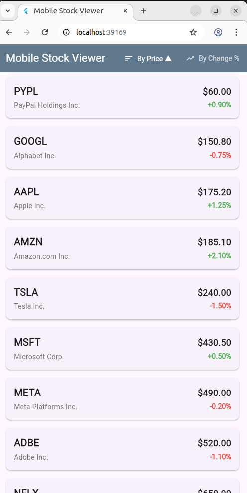
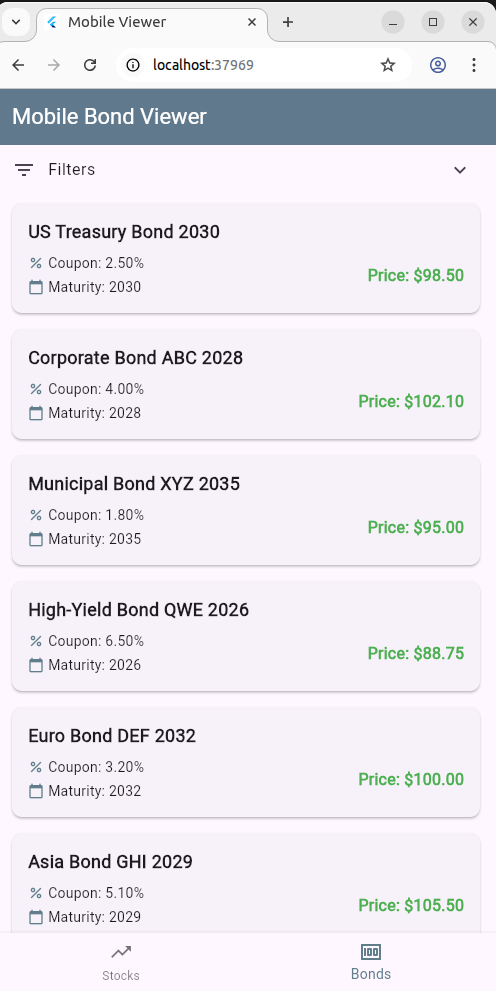
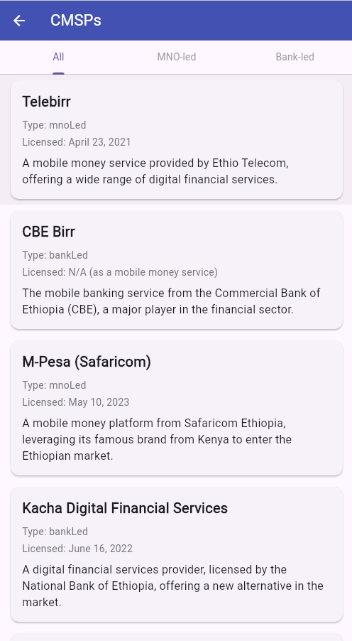

# 📱 Mobile Stock and Bond Viewer App

This is a simple **Flutter application** designed to display lists of mock stock and bond data with sorting and filtering capabilities, providing a clean and intuitive user interface for mobile devices.

---

## ✨ Features

### 📈 Stock Viewer

- **Mock Stock Data**  
  Displays a list of predefined stock entries including **Symbol**, **Company Name**, **Price**, and **Percentage Change**.

- **Clean UI**  
  Utilizes Flutter's **Material Design** components for a modern and user-friendly interface, with each stock presented in a card format.

- **Sorting Options:**

  - **By Price**: Sort stocks by current price (ascending/descending).
  - **By Change %**: Sort stocks by percentage change (highest positive to lowest negative).

- **Visual Cues**  
  Percentage changes are **color-coded**:  
  🟢 Green for positive change  
  🔴 Red for negative change

---

### 💵 Bond Viewer

- **Mock Bond Data**  
  Displays a list of predefined bond entries including **Name**, **Coupon %**, **Maturity Year**, and **Price**.

- **Filtering Options:**

  - **Coupon Range**: Filter bonds using a **slider** for minimum and maximum coupon percentage.
  - **Maturity Year**: Filter bonds using a **slider** for year range.

- **Real-time Filtering**  
  The bond list updates **dynamically** as filters are adjusted.

- **Clear Grouping**  
  Bonds are displayed in a **card format** for clean readability.

---

## 📸 Screenshots

### 📈 Stock Viewer Screen

### 💵 Bond Viewer Screen

## 

### CMPSs Viewer Screen

Enjoy viewing your mock financial data!
